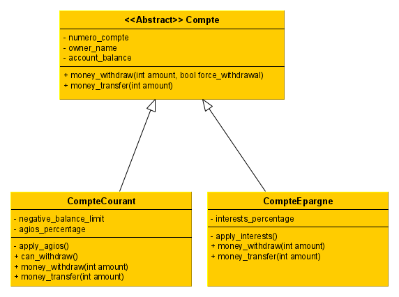
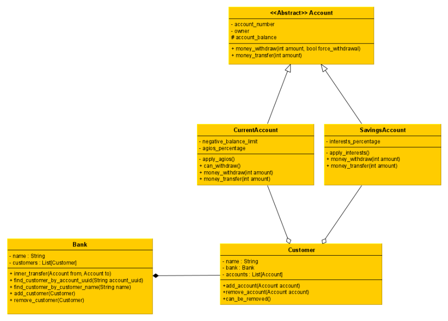

# Exercices sur les Comptes bancaires
## Sprint v0.1

### Sujet
Ecrire un programme qui implémente en POO un fonctionnement bancaire basique :  

- une classe Compte 
    - **attributs :** numero_compte, nom_proprietaire, solde  
    - **méthodes :** retrait, versement, afficher_solde  

- une classe fille CompteCourant, qui ajoute une gestion du découvert (montant maximum négatif 
possible) et des agios (pénalité de X % si le solde est inférieur à zéro) :  
    - **attributs :** autorisation_decouvert, pourcentage_agios  
    - **méthodes :** appliquer_agios  

- une classe fille CompteEpargne, qui ajoute :  
    - **attributs :** pourcentage_interets  
    - **méthodes :** appliquer_interets  

 

Le programme doit demander à l’utilisateur le compte concerné (« courant » ou « epargne ») et le montant 
de la transaction (positif pour un versement, négatif pour un retrait)  

Chaque appel de méthode doit afficher le solde avant opération, le détail de l’opération et le solde après 
opération. On suppose pour la simplicité de l’exercice que chaque modification du solde applique les agios 
ou intérêts du compte modifié. 

### Pytest

Des tests unitaires ont été redigés.

 - Execution de pytest
> pytest

ou

> python -m pytest

Si vous souhaitez executer uniquement ceux marqués par le tag cc:
> python -m pytest -m cc

### Pytest BDD
Vous aurez de plus amples informations sur pytest-bdd ici : [read the docs
](https://pytest-bdd.readthedocs.io/en/latest/)

Un ensemble de __features__ ont été écrites dans le dossier `src/features`
Celles-ci sont executées par le fichier `test_compte_courant_bdd.py`.

### Pylint
Un linter corrige plutôt le forme de votre code et non le fond.
Vous permettant de rédiger un code __dans les règles de l'art__.

> python -m pylint compte.py
> pylint compte.py

### Coverage
Afin de pouvoir visualiser correctement votre état d'avancement de tests.

> python -m coverage run -m pytest -m cc
> python -m coverage report

> pytest && coverage html

## Sprint v0.2

### Sujet

Maintenant que nous avons des comptes banquaires opérationnels, il est temps de modéliser la banque avec la gestion de ses clients. 
Implémentez les classes suivantes. 

Ainsi, l'attribut anciennement nommé owner_name devient owner et devient une référence vers un nouvel objet `Customer` et deux nouvelles classes sont à implémenter `Customer` et `Bank`.

Pour la réalisation de ces développements, le client demande à ce que les développements soient réalisés par le biais des tests. N'étant pas d'un profil technique, il se repose sur vos préférences quant aux choix entre du BDD ou du TDD. 

